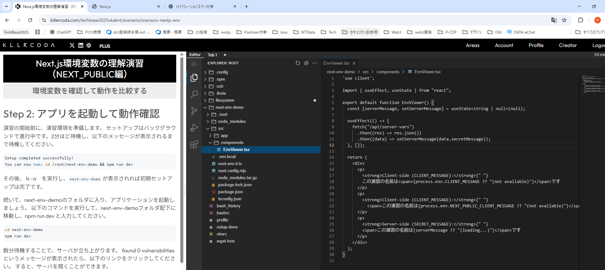

# Step 3: 表示される文字列の確認

ここに表示される文字列は、
/next-env-demo配下の .env.localフォルダで設定している環境変数を用い、
/next-env-demo/src/components/EnvViewer.tsx
によって環境変数を読みだして表示されています。

実際にコードや値を確認してみましょう。
画面中央付近の Editor ボタンを押下し、エディターを開いて
/next-env-demo/src/components/EnvViewer.tsx　や
/next-env-demo/.env.localの値を確認してみてください。
